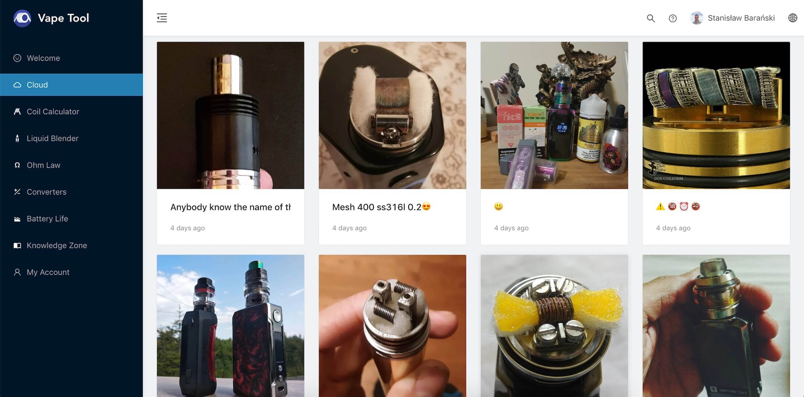

# Vape Tool Webapp

 This project uses Vite, antd, Flowbite-react (Tailwindcss).

## Environment Prepare

Install `node_modules`:

```bash
pnpm install
```

## Develop

```bash
pnpm dev
```

## VS Environment

Please add those lines to your `settings.json`:

```json
  "prettier.configPath": ".prettierrc.cjs",
  "editor.defaultFormatter": "esbenp.prettier-vscode",
  "editor.formatOnSave": true,
```
